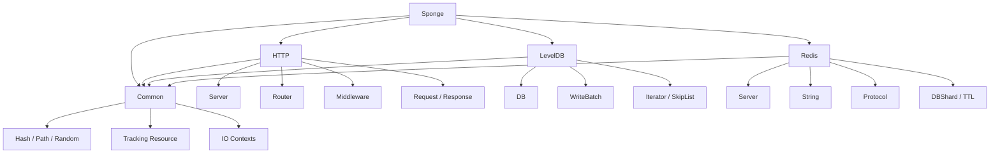

# Sponge

[](https://github.com/Doomjustin/sponge)
[](https://en.cppreference.com/w/cpp/23)
[](https://cmake.org/)
[](https://learn.microsoft.com/vcpkg/)
[](LICENCE)
[](#构建状态)

一个基于 C++23 的实验性基础设施项目，聚焦 HTTP 服务、存储系统和 Redis 风格运行时组件。

> Sponge 更像一个用于实现探索和接口验证的基础组件仓库，而不是一个已经产品化的框架集合。

## 目录

- [特性](#特性)
- [模块](#模块)
- [快速导航](#快速导航)
- [快速开始](#快速开始)
- [最小服务示例](#最小服务示例)
- [架构概览](#架构概览)
- [模块概览](#模块概览)
- [依赖](#依赖)
- [生成目标](#生成目标)
- [构建状态](#构建状态)
- [运行示例](#运行示例)
- [测试](#测试)
- [仓库结构](#仓库结构)
- [构建约定](#构建约定)
- [项目状态](#项目状态)
- [适合谁](#适合谁)

## 特性

- 基于 C++23、CMake 和 vcpkg manifest 的现代化工程结构
- 基于 Boost.Asio / Boost.Beast 的 HTTP 服务框架
- 面向学习与实验的 LevelDB 风格键值存储实现
- Redis 协议服务、字符串类型和分片运行时基础设施
- 模块化构建方式，库目标、示例程序和测试目标分离清晰

## 模块

- Common：通用工具、内存资源与 I/O 基础设施
- HTTP：基于 Boost.Asio / Boost.Beast 的 HTTP 服务框架
- LevelDB：面向学习与实验的 LevelDB 风格键值存储实现
- Redis：Redis 协议服务与相关基础类型实现

仓库当前提供两个可直接运行的示例程序：

- sponge.http-server
- sponge.redis-server

## 快速导航

- 主文档索引：[docs/README.md](docs/README.md)
- HTTP 模块文档：[docs/http/README.md](docs/http/README.md)
- LevelDB 模块文档：[docs/leveldb/README.md](docs/leveldb/README.md)
- Redis 模块文档：[docs/redis/README.md](docs/redis/README.md)
- 性能基准测试：[benchmark/README.md](benchmark/README.md)
- 构建入口：[CMakeLists.txt](CMakeLists.txt)
- 模块注册逻辑：[cmake/AddModule.cmake](cmake/AddModule.cmake)

## 快速开始

### 要求

- CMake 3.28 或更高版本
- 支持 C++23 的编译器
- 已安装并可用的 vcpkg

### 构建

```bash
cmake -S . -B build \
  -DCMAKE_TOOLCHAIN_FILE="$VCPKG_ROOT/scripts/buildsystems/vcpkg.cmake" \
  -DBUILD_TESTING=ON

cmake --build build
```

### 运行

```bash
./build/src/sponge.http-server
./build/src/sponge.redis-server
```

默认监听地址：

- HTTP：127.0.0.1:14444
- Redis：0.0.0.0:26379

### 测试

```bash
ctest --test-dir build --output-on-failure
```

## 最小服务示例

下面是一个最小可用的 HTTP 服务示例，展示如何使用 sponge::http 暴露一个 GET 路由：

```cpp
#include <cstdlib>
#include <string>

#include <sponge/http/server.h>

using namespace spg;

auto ping(const http::Request& request) -> std::string
{
    return "pong";
}

int main()
{
    http::Server server{ "127.0.0.1", "14444" };
    server.Get<"/ping">(ping);
    server.run();

    return EXIT_SUCCESS;
}
```

对应的最小 CMake 目标：

```cmake
add_executable(my_http_server main.cpp)
target_compile_features(my_http_server PRIVATE cxx_std_23)
target_link_libraries(my_http_server PRIVATE sponge::http)
```

验证请求：

```bash
curl -i http://127.0.0.1:14444/ping
```

如果你想看包含路径参数、JSON 请求体和聚合对象返回值的完整示例，查看 [src/http_server.cpp](src/http_server.cpp)。

## 架构概览

Sponge 当前可以粗略理解为“Common 作为底座，HTTP / LevelDB / Redis 分别在其上扩展不同方向的能力”：



如果从源码组织角度理解：

- Common 提供公共基础设施
- HTTP 偏向服务端框架与请求处理
- LevelDB 偏向存储结构与编码实验
- Redis 偏向协议服务、分片运行时和基础类型实现

## 模块概览

### Common

Common 模块提供一组可复用的基础能力，公开头文件位于 [include/sponge](include/sponge)。当前包括：

- [include/sponge/hash.h](include/sponge/hash.h)
- [include/sponge/io_contexts.h](include/sponge/io_contexts.h)
- [include/sponge/path.h](include/sponge/path.h)
- [include/sponge/random.h](include/sponge/random.h)
- [include/sponge/range.h](include/sponge/range.h)
- [include/sponge/tracking_resource.h](include/sponge/tracking_resource.h)
- [include/sponge/utility.h](include/sponge/utility.h)

### HTTP

HTTP 模块的公开头文件位于 [include/sponge/http](include/sponge/http)，核心入口是 [include/sponge/http/server.h](include/sponge/http/server.h)。

当前重点能力：

- 模板化路由注册
- 路径参数提取与类型转换
- 请求体自动反序列化
- 聚合对象自动序列化
- 中间件链式处理
- 基于协程的网络处理模型

示例程序见 [src/http_server.cpp](src/http_server.cpp)。模块详细说明见 [docs/http/README.md](docs/http/README.md)。

### LevelDB

LevelDB 模块的公开头文件位于 [include/sponge/leveldb](include/sponge/leveldb)，核心接口是 [include/sponge/leveldb/database.h](include/sponge/leveldb/database.h)。

当前实现包含多类存储基础组件，例如：

- block
- coding
- comparator
- iterator
- options
- skip_list
- status
- write_batch

这个模块更适合作为存储系统结构学习与实验对象。详细说明见 [docs/leveldb/README.md](docs/leveldb/README.md)。

### Redis

Redis 模块的公开头文件位于 [include/sponge/redis](include/sponge/redis)，当前主要对外暴露：

- [include/sponge/redis/server.h](include/sponge/redis/server.h)
- [include/sponge/redis/string.h](include/sponge/redis/string.h)
- [include/sponge/redis/list_pack.h](include/sponge/redis/list_pack.h)

示例程序见 [src/redis_server.cpp](src/redis_server.cpp)。模块详细说明见 [docs/redis/README.md](docs/redis/README.md)。

## 依赖

项目通过 vcpkg manifest 管理依赖，当前主要依赖包括：

- fmt
- spdlog
- ms-gsl
- catch2
- boost-asio
- boost-beast
- boost-uuid
- ctre
- glaze

依赖大致可以按职责分成四类：

- 基础格式化与日志：fmt、spdlog
- 网络与协议：Boost.Asio、Boost.Beast
- 通用基础设施：Microsoft.GSL、boost-uuid
- 模板与序列化：ctre、glaze
- 测试：Catch2

当前依赖声明位于 [vcpkg.json](vcpkg.json)，项目使用 vcpkg manifest 模式管理依赖版本与基线。

## 生成目标

主要库目标：

- sponge.common
- sponge.http
- sponge.leveldb
- sponge.redis

主要示例程序：

- build/src/sponge.http-server
- build/src/sponge.redis-server

如果启用了测试，还会生成对应模块测试目标，例如：

- sponge.common.test
- sponge.http.test
- sponge.leveldb.test
- sponge.redis.test

默认情况下，模块以静态库形式构建。

## 构建状态

当前仓库尚未配置公开的 CI 工作流，因此 README 顶部的构建徽章表示“本地构建导向”，而不是远端流水线状态。

当前可以确定的构建事实：

- 构建系统基于 CMake，入口见 [CMakeLists.txt](CMakeLists.txt)
- 模块和测试目标由 [src/CMakeLists.txt](src/CMakeLists.txt) 与 [cmake/AddModule.cmake](cmake/AddModule.cmake) 统一注册
- 项目依赖通过 [vcpkg.json](vcpkg.json) 管理
- 当 BUILD_TESTING 和 sponge_BUILD_TESTS 启用时，会生成对应模块测试目标

如果后续仓库增加 GitHub Actions 或其他 CI，可以直接把顶部的构建徽章替换为真实流水线状态徽章。

## 运行示例

启动 HTTP 示例：

```bash
./build/src/sponge.http-server
```

启动 Redis 示例：

```bash
./build/src/sponge.redis-server
```

默认监听地址：

- HTTP：127.0.0.1:14444
- Redis：0.0.0.0:26379

启动 HTTP 示例后，可以直接验证：

```bash
curl -i http://127.0.0.1:14444/user
curl -i http://127.0.0.1:14444/user/7
curl -i -X POST http://127.0.0.1:14444/ping
curl -i -X POST http://127.0.0.1:14444/ping/hello
curl -i -X POST http://127.0.0.1:14444/new_user \
  -H 'Content-Type: application/json' \
  -d '{"name":"alice"}'
```

## 测试

项目使用 Catch2，测试文件与实现文件按模块并列组织，命名约定为 *.test.cpp。

运行全部测试：

```bash
ctest --test-dir build --output-on-failure
```

## 性能基准测试

项目在 `benchmark/` 目录下提供了性能对比基准测试，用于评估关键数据结构在 C++ 环境中的性能表现：

**可用的基准测试程序：**

- `sds_vs_string_benchmark`：redis::String 与 std::string 的综合性能对比
- `sds_template_vs_polymorphic`：模板版本与多态版本的虚函数开销测试
- `cpp_string_verdict`：完整的性能评估与使用建议
- `pmr_string_comparison` ⭐：在公平 PMR 条件下的 std::string vs std::pmr::string vs redis::String 对比
- `arena_and_size_benchmark` ⭐ **新增**：Arena 分配器影响 + 短字符串 vs 长字符串分析

**运行基准测试：**

```bash
./build/benchmark/sds_vs_string_benchmark
./build/benchmark/sds_template_vs_polymorphic
./build/benchmark/cpp_string_verdict
./build/benchmark/pmr_string_comparison
./build/benchmark/arena_and_size_benchmark   # 实战场景分析
```

**性能数据要点：**

- **Arena 分配器的威力**：减少分配开销 3 倍以上
- **std::pmr::string + Arena**：甚至比 std::string 更快（灵活 + 性能兼得）
- **SSO 的关键性**：std::string 短字符串创建 ~0ms，redis::String 5863ms
- **std::string 性能一致**：无论字符串大小都保持高性能
- **redis::String 始终较慢**：即使配合最优条件仍然因架构而慢
- 详见 [docs/redis/README.md](docs/redis/README.md) 中的性能分析章节和 [benchmark/README.md](benchmark/README.md)

## 仓库结构

```text
include/sponge/
  *.h              Common 模块公开头文件
  http/            HTTP 模块公开头文件
  leveldb/         LevelDB 模块公开头文件
  redis/           Redis 模块公开头文件

src/
  common/          Common 模块实现与测试
  http/            HTTP 模块实现与测试
  leveldb/         LevelDB 模块实现与测试
  redis/           Redis 模块实现与测试
  http_server.cpp  HTTP 示例程序
  redis_server.cpp Redis 示例程序

benchmark/
  sds_vs_string_benchmark.cpp              redis::String vs std::string 综合对比
  sds_template_vs_polymorphic.cpp          多态 vs 模板版本的虚函数开销分析
  cpp_string_verdict.cpp                   C++ 字符串方案评估与结论
  pmr_string_comparison.cpp                std::string vs std::pmr::string vs redis::String 公平对比
  arena_and_size_benchmark.cpp             Arena 分配器 + 短字符串影响分析

docs/
  README.md        文档索引
  http/            HTTP 模块文档
  leveldb/         LevelDB 模块文档
  redis/           Redis 模块文档

cmake/
  AddModule.cmake  模块注册与测试目标生成逻辑
```

## 构建约定

项目里的模块通过 [cmake/AddModule.cmake](cmake/AddModule.cmake) 统一注册，约定包括：

- 每个模块目录至少包含一个非测试 .cpp 源文件
- 同目录下的 *.test.cpp 会在测试启用时自动汇总为独立测试目标
- 公开头文件统一从 include 目录暴露
- 实现代码可以通过 src 下的内部头文件协作

## 项目状态

这是一个活跃演进中的实验性仓库，模块成熟度并不完全一致：

- Common：适合作为公共基础工具集继续扩展
- HTTP：已经具备较完整的路由与中间件主流程
- LevelDB：适合围绕存储结构继续补足实现与测试
- Redis：当前更适合作为协议服务与底层类型实验场

如果你的目标是快速理解仓库，建议按下面顺序阅读：

1. [src/http_server.cpp](src/http_server.cpp)
2. [include/sponge/http/server.h](include/sponge/http/server.h)
3. [docs/http/README.md](docs/http/README.md)
4. [include/sponge/leveldb/database.h](include/sponge/leveldb/database.h)
5. [include/sponge/redis/string.h](include/sponge/redis/string.h)

## 适合谁

- 想阅读现代 C++ 基础设施代码的开发者
- 想实验 HTTP 路由、序列化和中间件接口设计的开发者
- 想拆解学习 LevelDB / Redis 风格内部结构的开发者
- 想在现有仓库上继续扩展模块、示例和测试的维护者