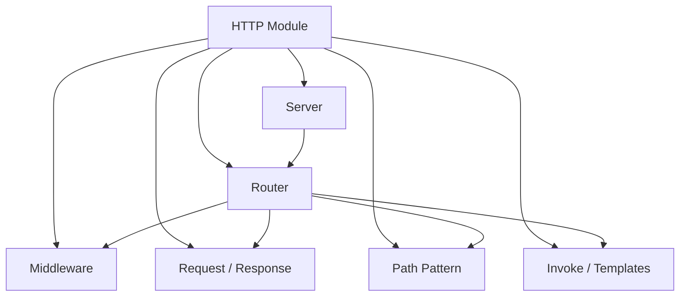

# HTTP 模块

Sponge 的 HTTP 模块提供了一个偏轻量、偏实验性的 C++ HTTP 服务框架，核心关注点是路由表达、参数绑定、中间件串联和响应转换。

## 目录

- [概述](#概述)
- [适合场景](#适合场景)
- [快速入口](#快速入口)
- [架构概览](#架构概览)
- [公开接口](#公开接口)
- [核心概念](#核心概念)
- [路由示例](#路由示例)
- [处理模型](#处理模型)
- [测试与现状](#测试与现状)
- [建议阅读顺序](#建议阅读顺序)
- [后续可以补的方向](#后续可以补的方向)

## 概述

HTTP 模块是 Sponge 当前最完整的高层模块之一。它基于 Boost.Asio、Boost.Beast、CTRE 和 Glaze，提供了一个偏“编译期路由 + 运行期调度”的轻量 HTTP 服务框架。

它适合以下场景：

- 快速搭建实验性 HTTP 服务
- 验证模板路由、路径参数提取和自动序列化的接口设计
- 作为后续 Web 框架能力扩展的基础

它当前并不是一个强调生态完备性的通用 Web 框架，更像一个以实现探索为导向的核心库。

## 适合场景

- 想快速搭建实验性 HTTP 服务
- 想验证模板路由、路径参数提取和自动序列化接口
- 想阅读基于 Boost.Asio / Boost.Beast 的服务端实现
- 想继续扩展中间件、请求绑定或响应转换规则

## 快速入口

- 模块目录：[include/sponge/http](include/sponge/http)
- 核心入口：[include/sponge/http/server.h](include/sponge/http/server.h)
- 示例程序：[src/http_server.cpp](src/http_server.cpp)
- 模块测试：[src/http](src/http)

## 架构概览



可以把这个模块理解成两层：

- Server / Session 负责网络接入与请求调度
- Router / Middleware / Invoke 负责请求匹配、参数绑定和响应生成

## 公开接口

公开头文件位于 [include/sponge/http](include/sponge/http)：

- [include/sponge/http/server.h](include/sponge/http/server.h)
- [include/sponge/http/router.h](include/sponge/http/router.h)
- [include/sponge/http/request.h](include/sponge/http/request.h)
- [include/sponge/http/response.h](include/sponge/http/response.h)
- [include/sponge/http/middleware.h](include/sponge/http/middleware.h)
- [include/sponge/http/path_pattern.h](include/sponge/http/path_pattern.h)
- [include/sponge/http/method.h](include/sponge/http/method.h)
- [include/sponge/http/status.h](include/sponge/http/status.h)
- [include/sponge/http/templates.h](include/sponge/http/templates.h)
- [include/sponge/http/session.h](include/sponge/http/session.h)
- [include/sponge/http/invoke.h](include/sponge/http/invoke.h)
- [include/sponge/http/exceptions.h](include/sponge/http/exceptions.h)

其中最主要的入口是 [include/sponge/http/server.h](include/sponge/http/server.h)：

```cpp
spg::http::Server server{ "127.0.0.1", "14444" };
server.Get<"/ping">(handler);
server.run();
```

## 核心概念

### 1. Server

Server 是面向使用者的顶层入口，负责：

- 持有监听地址和端口
- 管理 I/O 上下文
- 接收连接并派发 session
- 暴露路由注册接口

当前支持的注册方法有：

- Use
- Map
- Get
- Post
- Put
- Delete

这意味着常见场景下，业务代码并不需要直接操作 Router。

### 2. Router

Router 负责请求分发和中间件串联。它的路由注册方式是模板化的：

```cpp
router.Map<Method::Get, "/ping">(handler);
```

这种设计带来的特点是：

- 路由模式在编译期确定
- 路径匹配通过 CTRE 完成
- 路径参数会在调用 handler 时自动注入
- handler 的返回值会被统一转换为 HTTP 响应

当前支持的 Handler 返回类型主要包括：

- 可转换为字符串的值
- Response
- 聚合类型对象
- std::expected<T, Status>

其中聚合类型会通过 Glaze 自动序列化为 JSON。

### 3. 中间件

中间件通过 Use 注册，签名是“请求 + Next”的链式模型。当前内置了几个基础中间件：

- request_id
- access_log
- recover

recover 的作用尤其重要，它可以把异常转换为统一的错误响应，避免请求处理过程直接中断。

### 4. 请求与响应

Request 封装输入请求信息，Response 用于表达更显式的输出控制，例如：

- 自定义状态码
- 自定义响应头
- 自定义 content-type

如果只返回字符串或聚合对象，框架会自动生成 200 OK 响应。

## 路由示例

当前仓库里的示例程序位于 [src/http_server.cpp](src/http_server.cpp)：

```cpp
int main(int argc, char* argv[])
{
    http::Server server{ "127.0.0.1", "14444" };

    server.Post<"/ping/<str:message>">(ping_message);
    server.Post<"/ping">(ping);
    server.Get<"/user">(return_struct);
    server.Post<"/new_user">(new_user);
    server.Get<"/user/<int:id>">(get_user);

    server.run();
    return EXIT_SUCCESS;
}
```

这个示例展示了几种典型能力：

- 无参数路由
- 带命名路径参数的路由
- 请求体反序列化
- 聚合对象自动序列化为 JSON

启动后可用如下命令验证：

```bash
curl -i http://127.0.0.1:14444/user
curl -i http://127.0.0.1:14444/user/7
curl -i -X POST http://127.0.0.1:14444/ping
curl -i -X POST http://127.0.0.1:14444/ping/hello
curl -i -X POST http://127.0.0.1:14444/new_user \
  -H 'Content-Type: application/json' \
  -d '{"name":"alice"}'
```

## 处理模型

从结构上看，这个模块大致分成四层：

1. Server：监听与会话调度
2. Session：单连接请求处理
3. Router：路由匹配与中间件链
4. invoke / templates / path_pattern：参数绑定、序列化与模式转换

如果你要扩展这个模块，通常从下面三个方向之一入手：

- 增加新的 Handler 入参/返回值适配规则
- 增加新的内置中间件
- 增强路径模式和参数提取能力

## 测试与现状

HTTP 模块在当前仓库里已经有较完整的测试分布，尤其是这些部分：

- [src/http/router.test.cpp](src/http/router.test.cpp)
- [src/http/middleware.test.cpp](src/http/middleware.test.cpp)
- [src/http/path_pattern.test.cpp](src/http/path_pattern.test.cpp)
- [src/http/request.test.cpp](src/http/request.test.cpp)
- [src/http/response.test.cpp](src/http/response.test.cpp)
- [src/http/invoke.test.cpp](src/http/invoke.test.cpp)

相比之下，[src/http/server.test.cpp](src/http/server.test.cpp) 目前仍然是冒烟测试，说明网络层和端到端行为仍有继续补强测试的空间。

整体上看，HTTP 模块已经具备比较清晰的主流程和较好的扩展点，是当前仓库里最适合作为入口阅读的一部分。

## 建议阅读顺序

1. [src/http_server.cpp](src/http_server.cpp)
2. [include/sponge/http/server.h](include/sponge/http/server.h)
3. [include/sponge/http/router.h](include/sponge/http/router.h)
4. [src/http/router.cpp](src/http/router.cpp) 与 [src/http/router.test.cpp](src/http/router.test.cpp)
5. [src/http/path_pattern.cpp](src/http/path_pattern.cpp) 与 [src/http/path_pattern.test.cpp](src/http/path_pattern.test.cpp)
6. [src/http/invoke.cpp](src/http/invoke.cpp) 与 [src/http/templates.cpp](src/http/templates.cpp)

## 后续可以补的方向

- 端到端集成测试
- 更完整的错误映射策略
- 路由分组或子路由能力
- 更多请求体与响应体类型支持
- 更明确的日志与 tracing 接入点