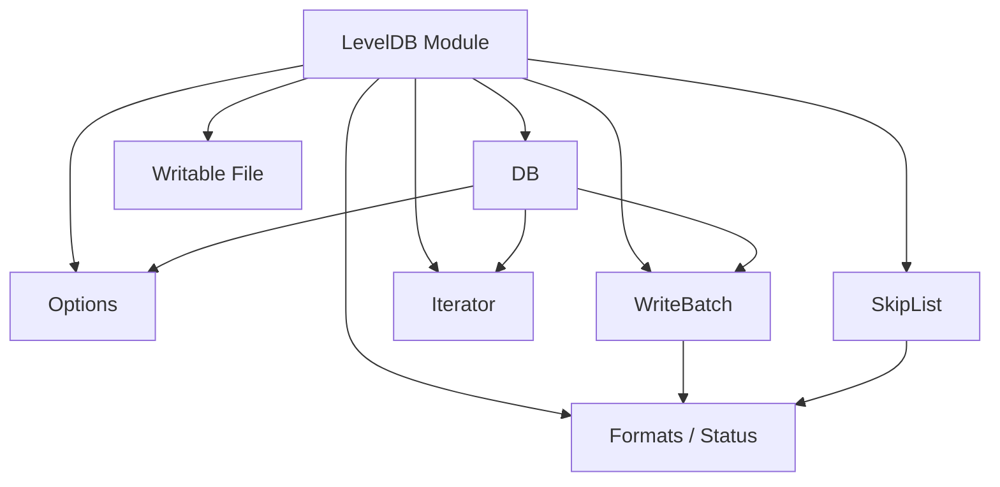

# LevelDB 模块

Sponge 的 LevelDB 模块是一个面向学习和实验的键值存储实现，重点在于把存储系统中的关键结构拆成独立组件，而不是完全对齐原版 LevelDB 的所有行为。

## 目录

- [概述](#概述)
- [适合场景](#适合场景)
- [快速入口](#快速入口)
- [架构概览](#架构概览)
- [公开接口](#公开接口)
- [核心概念](#核心概念)
- [代码结构](#代码结构)
- [最小使用示意](#最小使用示意)
- [测试与现状](#测试与现状)
- [建议阅读顺序](#建议阅读顺序)
- [后续可以补的方向](#后续可以补的方向)

## 概述

LevelDB 模块是一个面向学习和实验的 LevelDB 风格键值存储实现。它的重点不在于完全复刻原版 LevelDB，而在于把若干核心存储概念拆解成相对清晰、可单独测试的组件。

如果你的目标是理解 LSM 系列存储中常见的数据组织方式，这个模块的阅读价值高于直接把它当成生产数据库使用。

## 适合场景

- 想拆解学习键值存储的基础结构
- 想阅读编码格式、批量写入、跳表等存储核心部件
- 想把数据库能力拆成小模块逐步实现和测试
- 想对比接口设计和真实存储行为之间的取舍

## 快速入口

- 模块目录：[include/sponge/leveldb](include/sponge/leveldb)
- 核心接口：[include/sponge/leveldb/database.h](include/sponge/leveldb/database.h)
- 编码入口：[include/sponge/leveldb/write_batch.h](include/sponge/leveldb/write_batch.h)
- 模块测试：[src/leveldb](src/leveldb)

## 架构概览



这部分代码目前更像“数据库内部零件箱”，而不是一套已经完全封装好的数据库产品接口。

## 公开接口

公开头文件位于 [include/sponge/leveldb](include/sponge/leveldb)：

- [include/sponge/leveldb/comparator.h](include/sponge/leveldb/comparator.h)
- [include/sponge/leveldb/database.h](include/sponge/leveldb/database.h)
- [include/sponge/leveldb/formats.h](include/sponge/leveldb/formats.h)
- [include/sponge/leveldb/iterator.h](include/sponge/leveldb/iterator.h)
- [include/sponge/leveldb/options.h](include/sponge/leveldb/options.h)
- [include/sponge/leveldb/status.h](include/sponge/leveldb/status.h)
- [include/sponge/leveldb/write_batch.h](include/sponge/leveldb/write_batch.h)

其中 [include/sponge/leveldb/database.h](include/sponge/leveldb/database.h) 提供了最核心的抽象接口：

```cpp
struct DB {
    virtual auto put(const WriteOptions&, std::string_view key, std::string_view value)
        -> std::expected<void, Status> = 0;

    virtual auto remove(const WriteOptions&, std::string_view key)
        -> std::expected<void, Status> = 0;

    virtual auto get(const ReadOptions&, std::string_view key)
        -> std::expected<std::string, Status> = 0;

    static auto open(const Options& options, std::string_view db_path)
        -> std::expected<std::unique_ptr<DB>, Status>;
};
```

## 核心概念

### 1. DB 抽象

DB 是模块对外暴露的主接口，负责定义最基础的键值存储行为：

- 打开数据库
- 写入键值
- 删除键值
- 读取键值
- 批量写入
- 创建迭代器
- 获取快照

这层接口本身尽量稳定，底层可以继续演化。

### 2. Options / ReadOptions / WriteOptions

[include/sponge/leveldb/options.h](include/sponge/leveldb/options.h) 里定义了几组基础配置：

- Options：数据库级配置
- ReadOptions：读取行为配置
- WriteOptions：写入行为配置

当前已经暴露的配置包括：

- create_if_missing
- error_if_exists
- paranoid_checks
- write_buffer_size
- max_open_files
- block_cache_size
- sync
- verify_checksums
- fill_cache

这使得模块接口已经具备了继续向“更像数据库”的方向扩展的基础。

### 3. WriteBatch

WriteBatch 是这部分实现里一个很值得先读的类型。它把多条写操作编码进一段连续字节序列里，并支持后续遍历执行。

当前支持的操作包括：

- put
- erase
- clear
- for_each
- sequence
- count

从现有接口来看，WriteBatch 已经体现出比较明确的内部协议设计：

- 固定 12 字节头部
- 头部保存 sequence number 和记录数
- 后续按 ValueType + varint 长度 + 数据内容编码

如果你想快速理解模块的数据编码风格，优先读 WriteBatch。

### 4. 状态与格式

[include/sponge/leveldb/status.h](include/sponge/leveldb/status.h) 和 [include/sponge/leveldb/formats.h](include/sponge/leveldb/formats.h) 提供了错误表达和编码格式基础设施。它们是很多更底层组件的公共依赖。

## 代码结构

[src/leveldb](src/leveldb) 目录下已经拆出了多个较独立的实现单元：

- block
- coding
- comparator
- database
- formats
- iterator
- options
- skip_list
- status
- writable_file
- write_batch

这说明模块当前的设计方向是先把存储基础设施拆成小块，再逐步把更完整的数据库行为串起来。

## 最小使用示意

```cpp
#include <sponge/leveldb/database.h>

using namespace spg::leveldb;

auto opened = DB::open(Options{ .create_if_missing = true }, "./demo.db");
if (!opened) {
    return;
}

auto& db = *opened.value();
db.put(WriteOptions{}, "name", "sponge");

auto result = db.get(ReadOptions{}, "name");
```

这里更重要的是接口形态，而不是示例行为本身。当前模块仍处于持续演进阶段，具体能力覆盖度要以源码和测试为准。

## 测试与现状

LevelDB 模块已经为多数组件建立了对应测试文件，例如：

- [src/leveldb/block.test.cpp](src/leveldb/block.test.cpp)
- [src/leveldb/coding.test.cpp](src/leveldb/coding.test.cpp)
- [src/leveldb/comparator.test.cpp](src/leveldb/comparator.test.cpp)
- [src/leveldb/database.test.cpp](src/leveldb/database.test.cpp)
- [src/leveldb/formats.test.cpp](src/leveldb/formats.test.cpp)
- [src/leveldb/iterator.test.cpp](src/leveldb/iterator.test.cpp)
- [src/leveldb/options.test.cpp](src/leveldb/options.test.cpp)
- [src/leveldb/skip_list.test.cpp](src/leveldb/skip_list.test.cpp)
- [src/leveldb/status.test.cpp](src/leveldb/status.test.cpp)
- [src/leveldb/writable_file.test.cpp](src/leveldb/writable_file.test.cpp)
- [src/leveldb/write_batch.test.cpp](src/leveldb/write_batch.test.cpp)

不过从现状看，一部分测试仍然是冒烟测试，说明接口轮廓已经搭起来，但更深入的行为验证仍值得继续补充。

整体来看，这个模块已经把若干关键抽象拆分出来了，但距离完整数据库实现仍然有明显演进空间。

## 建议阅读顺序

1. [include/sponge/leveldb/database.h](include/sponge/leveldb/database.h)
2. [include/sponge/leveldb/options.h](include/sponge/leveldb/options.h)
3. [include/sponge/leveldb/write_batch.h](include/sponge/leveldb/write_batch.h)
4. [src/leveldb/write_batch.cpp](src/leveldb/write_batch.cpp)
5. [src/leveldb/coding.cpp](src/leveldb/coding.cpp)
6. [src/leveldb/skip_list.cpp](src/leveldb/skip_list.cpp)
7. [src/leveldb/database.cpp](src/leveldb/database.cpp)

## 后续可以补的方向

- 更系统的数据库打开 / 恢复流程文档
- compaction、memtable、sstable 等更完整的存储层说明
- 更有代表性的行为测试，而不只是冒烟测试
- 崩溃恢复和校验策略说明
- 明确各组件与原版 LevelDB 设计的异同