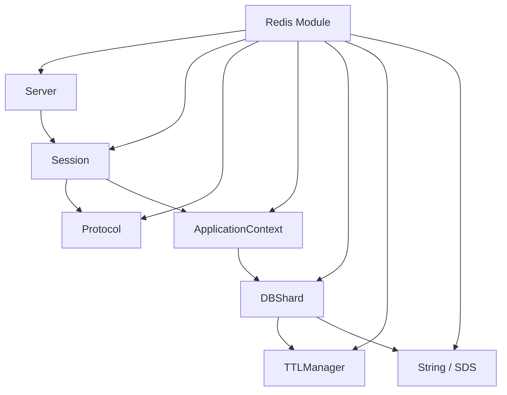

# Redis 模块

Sponge 的 Redis 模块把协议服务、分片运行时、TTL 语义和字符串类型实现放在同一块演进，适合作为 Redis 风格服务端内部结构的实验场。

## 目录

- [概述](#概述)
- [适合场景](#适合场景)
- [快速入口](#快速入口)
- [架构概览](#架构概览)
- [公开接口](#公开接口)
- [核心概念](#核心概念)
- [ListPack（紧凑列表）](#listpack紧凑列表)
- [内部结构](#内部结构)
- [运行示例](#运行示例)
- [服务端基线性能](#服务端基线性能)
- [测试与现状](#测试与现状)
- [建议阅读顺序](#建议阅读顺序)
- [后续可以补的方向](#后续可以补的方向)

## 概述

Redis 模块当前承担两类职责：

- Redis 协议服务端相关实现
- Redis 风格底层数据结构与内存管理实验

这意味着它不是一个单纯的“协议解析器”，也不是一个单纯的“容器库”，而是在服务端运行时、分片存储、TTL 管理和字符串实现之间做组合。

如果你对“一个轻量 Redis 风格服务要由哪些基础组件组成”感兴趣，这个模块很值得读。

## 适合场景

- 想理解一个 Redis 风格服务端需要哪些基础组件
- 想阅读 RESP 协议解析、分片存储和 TTL 语义实现
- 想对比 Redis 风格字符串与标准字符串容器的接口差异
- 想继续扩展命令支持、线程模型或内存管理策略

## 快速入口

- 模块目录：[include/sponge/redis](include/sponge/redis)
- 服务入口：[include/sponge/redis/server.h](include/sponge/redis/server.h)
- 字符串类型：[include/sponge/redis/string.h](include/sponge/redis/string.h)
- 紧凑列表类型：[include/sponge/redis/list_pack.h](include/sponge/redis/list_pack.h)
- 示例程序：[src/redis_server.cpp](src/redis_server.cpp)
- 内部实现：[src/redis](src/redis)

## 架构概览



这个模块的重点不只是“解析 Redis 请求”，而是把协议层、执行层和内部数据面一起组织起来。

## 公开接口

公开头文件位于 [include/sponge/redis](include/sponge/redis)：

- [include/sponge/redis/server.h](include/sponge/redis/server.h)
- [include/sponge/redis/string.h](include/sponge/redis/string.h)
- [include/sponge/redis/list_pack.h](include/sponge/redis/list_pack.h)

从仓库暴露面来看，当前对外更稳定的部分主要是：

- Server：服务端入口
- String：Redis 风格动态字符串
- ListPack：Redis 风格紧凑列表容器

而更多服务端内部能力则位于 [src/redis](src/redis) 下的内部头文件中。

## ListPack（紧凑列表）

ListPack 对应 Redis 中 listpack 风格的紧凑编码容器，适合在“小对象、紧凑存储、顺序迭代”场景下使用。

相关入口如下：

- 接口定义：[include/sponge/redis/list_pack.h](include/sponge/redis/list_pack.h)
- 实现代码：[src/redis/list_pack.cpp](src/redis/list_pack.cpp)
- 单元测试：[src/redis/list_pack.test.cpp](src/redis/list_pack.test.cpp)

当前接口重点包括：

- push_back：追加整数或字符串
- insert：在指定迭代器前插入元素
- erase：支持单元素和区间删除
- begin/end 与 rbegin/rend：支持正向与反向遍历

由于 listpack 的编码策略依赖元素类型和长度，建议直接结合测试阅读边界行为，例如：

- 数字字符串是否走整数编码路径
- 以 "0" 开头字符串是否保持字符串编码
- 中间插入与区间删除后的顺序与字节布局一致性

最小示例（包含 push_back / insert / erase / 遍历）：

```cpp
#include <cstdint>
#include <string_view>
#include <variant>

#include <sponge/redis/list_pack.h>

using namespace spg::redis;

void listpack_demo()
{
	ListPack lp{ 128 };

	lp.push_back(1);
	lp.push_back("2");                       // 数字字符串，默认会尝试按整数编码
	lp.push_back(std::string_view{ "hello" });

	auto pos = lp.begin();
	++pos;
	lp.insert(pos, 42);                        // 在第二个元素前插入

	lp.erase(lp.begin());                      // 删除第一个元素

	for (auto it = lp.begin(); it != lp.end(); ++it) {
		auto elem = *it;
		if (std::holds_alternative<int64_t>(elem)) {
			auto n = std::get<int64_t>(elem);
			(void)n;
		} else {
			auto s = std::get<std::string_view>(elem);
			(void)s;
		}
	}
}
```

## 核心概念

### 1. Server

Server 是对外可直接运行的 Redis 服务入口，构造参数包括：

- address
- port
- threads

最小示例如下：

```cpp
using namespace spg::redis;

Server server{ "0.0.0.0", "26379", 12 };
server.run();
```

从接口形态可以看出，当前服务端设计已经考虑了多线程运行。

### 2. RESP 协议解析

内部的 [src/redis/protocol.h](src/redis/protocol.h) 暴露了 RESP 请求解析入口：

```cpp
resp::parse_request(std::string_view buffer, std::pmr::memory_resource* resource)
```

它会把输入缓冲区解析成命令集合，同时返回已消费字节数。这意味着它已经在朝“流式读取 + 增量解析”的方向设计，而不是只处理一次性完整输入。

### 3. String

[include/sponge/redis/string.h](include/sponge/redis/string.h) 提供了 Redis 风格动态字符串实现。它具备几个典型特点：

- 基于 PMR 内存资源分配
- 显式维护 size 与 capacity
- 始终保证以 '\0' 结尾
- 提供更接近 Redis SDS 的扩容与收缩语义

当前比较重要的方法包括：

- append
- reserve
- resize
- clear
- shrink_to_fit
- assign
- view

此外还提供了两个实用辅助接口：

- string_cast：把整数转换为 String
- format：把 fmt 格式化结果直接写入 String

#### 性能对比与使用建议

String 基于 Redis SDS（Simple Dynamic String）底层实现，提供了与原生 Redis 一致的数据结构语义。然而在 C++ 环境中，需要理解其与 `std::string` 的性能差异：

**性能对比（基准测试结果）：**

| 场景 | std::string | std::pmr::string | redis::String | 相对倍数 |
|------|:----------:|:---------------:|:-------------:|:-------:|
| size() 查询 (500M) | 113 ms | 115 ms | 5249 ms | **46.4x** |
| 创建字符串 (5M) | 61 ms | 216 ms | 609 ms | **10x** |
| Append (1M) | 28 ms | 124 ms | 386 ms | **13.8x** |
| capacity() 查询 (100M) | 22 ms | 44 ms | 633 ms | **28.6x** |
| 内存占用 (1M × 100B) | 125.89 MB | 133.51 MB | 110.63 MB | 11% 少 |

**关键发现：**

🎯 **std::pmr::string 与 std::string 性能相近**（1x-4.4x）
- 说明 PMR 本身的虚函数开销很小
- 编译器能充分优化虚函数调用
- 性能差异主要来自内存分配策略

🎯 **redis::String 即使在公平的 PMR 条件下仍然极其缓慢**（10-46.4x）
- 这彻底证明了性能问题的根源
- **不是 PMR 的问题**（std::pmr::string 很快）
- **不是虚函数的问题**（std::pmr::string 使用虚函数但很快）
- **而是 SDS 架构设计本身**

**性能劣势根本原因分析：**

1. **虚函数调用开销**（可优化的 ~24%）
   - ✓ 实测验证：std::pmr::string 只慢 1.01x，虚函数开销已充分优化
   - redis::String 的虚函数贡献不超过总性能差异的 1/4

2. **类型分派成本**（难优化的 ~15-20%）
   - SDS 使用 4 分支 switch 进行运行时类型选择（Type8/16/32/64）
   - 编译器无法完全消除这个分派开销

3. **间接寻址与架构差异**（根本性的 ~50-70%）
   - SDS 采用后向布局（header before data）
   - 每次访问 size/capacity 需要指针运算回溯定位 header
   - std::string 直接内联存储，编译器充分内联优化
   - CPU 缓存表现差异显著
   - 这是根本的架构差异，**无法通过优化消除**

**使用建议：**

- ✅ **一般 C++ 应用**：优先使用 `std::string`，性能全面领先（基准选择）
- ✅ **自定义内存管理**：使用 `std::pmr::string`，几乎无性能损失
- ✅ **大量小对象场景**：优先利用 std::string 的 SSO（短字符串零成本）
- ✅ **性能关键路径**：必须选择 `std::string`
- ✅ **内存约束场景**：若追求极限紧凑，String 可节省 ~11% 内存（代价是 10-46x 性能）
- ✅ **Arena 分配器**：若需要自定义分配，std::pmr::string + Arena 甚至比 std::string 更快
- ✅ **Redis 源码学习**：String 帮助理解 SDS 底层结构设计

**关键性能发现：**

1. **Arena 分配器效果明显** — 减少分配开销 3 倍以上
   - std::pmr::monotonic_buffer_resource 是很好的选择
   - 即使配合 Arena，redis::String 仍因架构而慢

2. **SSO (Small String Optimization) 至关重要** — 短字符串创建几乎无成本
   - std::string 对 ≤23B 字符串避免分配
   - redis::String 每次都要付出硬件代价（5863ms 对 100M 次创建）
   - 实际应用中很常见（HTTP 头、URL 参数等）

3. **字符串大小对性能无影响** — 根本是架构差异
   - std::string 性能一致（1B 到 10KB 都是 ~22ms）
   - redis::String 性能也一致（1B 到 10KB 都是 ~1050ms）
   - 说明不是 SSO 问题，而是寻址和类型分派成本

**结论**：String 主要用于**学习与研究**，深刻理解为什么 Redis 在 C 中选择了 SDS 设计。生产环境中应该选择 `std::string` 或 `std::pmr::string`。

详细的性能分析见：[benchmark/README.md](../../benchmark/README.md)
- PMR 公平对比：[benchmark/README.md#4-pmr_string_comparison--new](../../benchmark/README.md#4-pmr_string_comparison--new)
- Arena & 字符串大小分析：[benchmark/README.md#5-arena_and_size_benchmark--new](../../benchmark/README.md#5-arena_and_size_benchmark--new)

### 4. ApplicationContext 与分片

Redis 模块的内部结构不是单一全局哈希表，而是已经引入了 ApplicationContext 和 DBShard 这样的运行时组织方式。

ApplicationContext 负责：

- 管理多个 I/O 上下文
- 管理分片对应的内存资源
- 管理多个 DBShard 实例
- 汇总内存使用情况

DBShard 负责单分片内的数据操作，目前已经支持：

- 字符串值
- 整数值
- 键存在性判断
- 类型判断
- 过期时间设置与取消
- TTL 查询

这说明模块已经不仅仅停留在“能接收 Redis 请求”，而是在朝“具备基本数据面”的方向推进。

### 5. TTL 管理

TTLManager 把过期时间和持久化状态的表示做了独立抽象，负责：

- 计算 expire_at
- 判断键是否过期
- 计算剩余 TTL
- 表达 persistent 状态

这层抽象有助于把时间语义从 DBShard 的主体逻辑中拆出去。

## 内部结构

[src/redis](src/redis) 目录下当前已经包含这些核心实现单元：

- application_context
- dash_table
- db_shard
- protocol
- sds
- server
- session
- skip_list
- list_pack
- string
- ttl_manager

从命名上可以看出，这个模块当前同时在推进：

- 服务端接入
- 协议解析
- 内部存储组织
- 底层数据结构实验

## 运行示例

仓库自带示例程序位于 [src/redis_server.cpp](src/redis_server.cpp)，构建后可以直接启动：

```bash
./build/src/sponge.redis-server
```

默认监听地址是 0.0.0.0:26379。

[README.md](README.md) 当前没有列出完整命令集，因此如果你要继续扩展用户文档，建议优先从 [src/redis/protocol.h](src/redis/protocol.h)、[src/redis/session.h](src/redis/session.h) 和 [src/redis/db_shard.h](src/redis/db_shard.h) 三部分入手梳理“支持了哪些命令”。

## 服务端基线性能

下面这组数据来自服务端命令处理逻辑“什么都不做，只返回 ok”的基线场景，用来衡量当前网络栈、协议解析和请求分发路径的裸性能上限。

测试命令：

```bash
redis-benchmark -p 26379 -c 50 -n 2000000 -t set,get
```

测试条件：

- 监听端口：26379
- 并发连接数：50
- 总请求数：2000000
- 压测命令：SET、GET
- payload：3 bytes
- keep alive：开启
- multi-thread：关闭
- 命令语义：服务端不执行实际存储逻辑，仅返回 ok

压测时出现 `WARNING: Could not fetch server CONFIG`，说明当前服务未提供 `CONFIG` 查询能力；这不影响 `SET` / `GET` 请求本身的性能数据。

**摘要结果：**

| 命令 | 总耗时 | 吞吐 | 平均延迟 | p50 | p95 | p99 | 最大延迟 |
|------|:------:|:----:|:--------:|:---:|:---:|:---:|:--------:|
| SET | 20.75 s | 96399.48 req/s | 0.271 ms | 0.271 ms | 0.327 ms | 0.383 ms | 10.103 ms |
| GET | 20.89 s | 95753.34 req/s | 0.273 ms | 0.271 ms | 0.335 ms | 0.383 ms | 1.391 ms |

**关键观察：**

- 在空操作基线下，`SET` 与 `GET` 都稳定在约 9.6 万 req/s。
- 中位延迟都约为 0.271 ms，说明请求主路径的常态开销比较接近。
- `p95` 和 `p99` 都维持在 0.4 ms 以内，尾延迟在大多数请求上比较收敛。
- `SET` 出现了少量长尾尖峰，最大延迟达到 10.103 ms；`GET` 的最大延迟则控制在 1.391 ms。

**百分位细节：**

| 命令 | p75 | p87.5 | p93.75 | p96.875 | p98.438 | p99.219 | p99.609 | p99.805 | p99.902 | p99.951 | p99.976 |
|------|:---:|:-----:|:------:|:-------:|:-------:|:-------:|:-------:|:-------:|:-------:|:-------:|:-------:|
| SET | 0.279 ms | 0.303 ms | 0.327 ms | 0.343 ms | 0.367 ms | 0.391 ms | 0.415 ms | 0.431 ms | 0.447 ms | 0.471 ms | 0.487 ms |
| GET | 0.287 ms | 0.303 ms | 0.327 ms | 0.343 ms | 0.367 ms | 0.391 ms | 0.415 ms | 0.431 ms | 0.447 ms | 0.463 ms | 0.487 ms |

如果后续接入真实 KV 读写、TTL、分片路由或持久化逻辑，这组数据可以作为回归对照，用来区分“协议/网络开销”和“命令执行开销”各自带来的损耗。

### Pipeline 模式基线

在 pipeline 模式下，同样使用“命令什么都不做，只返回 ok”的实现进行压测：

```bash
redis-benchmark -p 26379 -c 50 -n 2000000 -t set,get -P 256
```

**结果摘要：**

| 命令 | pipeline | 吞吐 | 平均延迟 | p50 | p95 | p99 | 最大延迟 |
|------|:--------:|:----:|:--------:|:---:|:---:|:---:|:--------:|
| SET | 256 | 5115227.50 req/s | 1.320 ms | 1.239 ms | 2.399 ms | 3.319 ms | 9.471 ms |
| GET | 256 | 6230567.00 req/s | 1.075 ms | 1.007 ms | 1.895 ms | 2.311 ms | 4.031 ms |

**关键百分位：**

| 命令 | p75 | p87.5 | p93.75 | p96.875 | p98.438 | p99.219 | p99.609 | p99.805 | p99.902 | p99.951 | p99.976 |
|------|:---:|:-----:|:------:|:-------:|:-------:|:-------:|:-------:|:-------:|:-------:|:-------:|:-------:|
| SET | 1.743 ms | 2.103 ms | 2.335 ms | 2.791 ms | 3.231 ms | 3.439 ms | 3.671 ms | 4.279 ms | 5.367 ms | 6.935 ms | 8.215 ms |
| GET | 1.343 ms | 1.591 ms | 1.831 ms | 1.999 ms | 2.215 ms | 2.399 ms | 2.607 ms | 2.767 ms | 2.863 ms | 3.463 ms | 3.831 ms |

**补充复测（只输出摘要）：**

同一组参数在加上 `-q` 后，redis-benchmark 只输出摘要行，不打印完整延迟分布：

```bash
redis-benchmark -p 26379 -c 50 -n 2000000 -t set,get -P 256 -q
```

| 命令 | 吞吐 | p50 |
|------|:----:|:---:|
| SET | 5025261.50 req/s | 1.319 ms |
| GET | 6097686.00 req/s | 1.007 ms |

**对比观察：**

- 开启 pipeline 之后，吞吐从单请求模式的约 9.6 万 req/s 提升到 510 万到 620 万 req/s，提升非常明显。
- `GET` 在该组测试中仍明显高于 `SET`，说明在批量发送条件下，请求路径上的细微差别会被进一步放大。
- 虽然 p50 上升到约 1.0 到 1.3 ms，但这是高吞吐批处理场景下常见的吞吐换延迟现象，不能直接和非 pipeline 模式的一次一请求延迟横向比较。
- `-q` 只影响 redis-benchmark 的输出格式，不改变请求模式本身。两次结果有小幅差异，属于独立运行时的正常波动；在你已经观察到 `nodelay` 很敏感的前提下，更应该把 socket 选项与运行环境一起记录。

**注意：** `nodelay` 的开关对这组 pipeline 数据影响非常大。如果测试时 `TCP_NODELAY` 配置不同，结果可能出现数量级上的偏移，因此后续做横向对比时必须把 `nodelay` 状态作为前提一起记录。

压测时同样出现 `WARNING: Could not fetch server CONFIG`，原因仍然是服务端未实现 `CONFIG` 查询；这不影响这里记录的 `SET` / `GET` 吞吐结果。

## 测试与现状

Redis 模块已经有较完整的内部组件测试分布，例如：

- [src/redis/application_context.test.cpp](src/redis/application_context.test.cpp)
- [src/redis/dash_table.test.cpp](src/redis/dash_table.test.cpp)
- [src/redis/db_shard.test.cpp](src/redis/db_shard.test.cpp)
- [src/redis/protocol.test.cpp](src/redis/protocol.test.cpp)
- [src/redis/sds.test.cpp](src/redis/sds.test.cpp)
- [src/redis/server.test.cpp](src/redis/server.test.cpp)
- [src/redis/session.test.cpp](src/redis/session.test.cpp)
- [src/redis/skip_list.test.cpp](src/redis/skip_list.test.cpp)
- [src/redis/list_pack.test.cpp](src/redis/list_pack.test.cpp)
- [src/redis/string.test.cpp](src/redis/string.test.cpp)
- [src/redis/ttl_manager.test.cpp](src/redis/ttl_manager.test.cpp)

这说明模块的实现覆盖面不小，但由于公开文档仍较少，当前最有效的理解方式仍然是“头文件 + 测试 + 示例程序”三者结合阅读。

整体来看，Redis 模块已经具备明显的服务端雏形，但命令覆盖面、文档完整度和行为一致性仍然有不少可补空间。

## 建议阅读顺序

1. [src/redis_server.cpp](src/redis_server.cpp)
2. [include/sponge/redis/server.h](include/sponge/redis/server.h)
3. [include/sponge/redis/string.h](include/sponge/redis/string.h)
4. [include/sponge/redis/list_pack.h](include/sponge/redis/list_pack.h)
5. [src/redis/list_pack.cpp](src/redis/list_pack.cpp) 与 [src/redis/list_pack.test.cpp](src/redis/list_pack.test.cpp)
6. [src/redis/protocol.h](src/redis/protocol.h) 与 [src/redis/protocol.cpp](src/redis/protocol.cpp)
7. [src/redis/db_shard.h](src/redis/db_shard.h) 与 [src/redis/db_shard.cpp](src/redis/db_shard.cpp)
8. [src/redis/application_context.h](src/redis/application_context.h) 与 [src/redis/application_context.cpp](src/redis/application_context.cpp)
9. [src/redis/ttl_manager.h](src/redis/ttl_manager.h) 与 [src/redis/ttl_manager.cpp](src/redis/ttl_manager.cpp)

## 后续可以补的方向

- 支持命令列表与行为说明
- 协议层错误处理文档
- 分片策略与线程模型说明
- 内存占用与 PMR 资源策略文档
- 和真实 Redis 语义的一致性/差异性说明