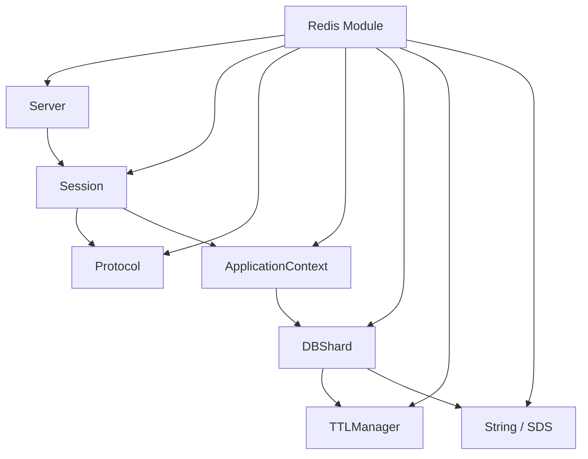

# Redis 模块

Sponge 的 Redis 模块把协议服务、分片运行时、TTL 语义和字符串类型实现放在同一块演进，适合作为 Redis 风格服务端内部结构的实验场。

## 目录

- [概述](#概述)
- [适合场景](#适合场景)
- [快速入口](#快速入口)
- [架构概览](#架构概览)
- [公开接口](#公开接口)
- [核心概念](#核心概念)
- [ListPack（紧凑列表）](#listpack紧凑列表)
- [内部结构](#内部结构)
- [运行示例](#运行示例)
- [测试与现状](#测试与现状)
- [建议阅读顺序](#建议阅读顺序)
- [后续可以补的方向](#后续可以补的方向)

## 概述

Redis 模块当前承担两类职责：

- Redis 协议服务端相关实现
- Redis 风格底层数据结构与内存管理实验

这意味着它不是一个单纯的“协议解析器”，也不是一个单纯的“容器库”，而是在服务端运行时、分片存储、TTL 管理和字符串实现之间做组合。

如果你对“一个轻量 Redis 风格服务要由哪些基础组件组成”感兴趣，这个模块很值得读。

## 适合场景

- 想理解一个 Redis 风格服务端需要哪些基础组件
- 想阅读 RESP 协议解析、分片存储和 TTL 语义实现
- 想对比 Redis 风格字符串与标准字符串容器的接口差异
- 想继续扩展命令支持、线程模型或内存管理策略

## 快速入口

- 模块目录：[include/sponge/redis](include/sponge/redis)
- 服务入口：[include/sponge/redis/server.h](include/sponge/redis/server.h)
- 字符串类型：[include/sponge/redis/string.h](include/sponge/redis/string.h)
- 紧凑列表类型：[include/sponge/redis/list_pack.h](include/sponge/redis/list_pack.h)
- 示例程序：[src/redis_server.cpp](src/redis_server.cpp)
- 内部实现：[src/redis](src/redis)

## 架构概览



这个模块的重点不只是“解析 Redis 请求”，而是把协议层、执行层和内部数据面一起组织起来。

## 公开接口

公开头文件位于 [include/sponge/redis](include/sponge/redis)：

- [include/sponge/redis/server.h](include/sponge/redis/server.h)
- [include/sponge/redis/string.h](include/sponge/redis/string.h)
- [include/sponge/redis/list_pack.h](include/sponge/redis/list_pack.h)

从仓库暴露面来看，当前对外更稳定的部分主要是：

- Server：服务端入口
- String：Redis 风格动态字符串
- ListPack：Redis 风格紧凑列表容器

而更多服务端内部能力则位于 [src/redis](src/redis) 下的内部头文件中。

## ListPack（紧凑列表）

ListPack 对应 Redis 中 listpack 风格的紧凑编码容器，适合在“小对象、紧凑存储、顺序迭代”场景下使用。

相关入口如下：

- 接口定义：[include/sponge/redis/list_pack.h](include/sponge/redis/list_pack.h)
- 实现代码：[src/redis/list_pack.cpp](src/redis/list_pack.cpp)
- 单元测试：[src/redis/list_pack.test.cpp](src/redis/list_pack.test.cpp)

当前接口重点包括：

- push_back：追加整数或字符串
- insert：在指定迭代器前插入元素
- erase：支持单元素和区间删除
- begin/end 与 rbegin/rend：支持正向与反向遍历

由于 listpack 的编码策略依赖元素类型和长度，建议直接结合测试阅读边界行为，例如：

- 数字字符串是否走整数编码路径
- 以 "0" 开头字符串是否保持字符串编码
- 中间插入与区间删除后的顺序与字节布局一致性

最小示例（包含 push_back / insert / erase / 遍历）：

```cpp
#include <cstdint>
#include <string_view>
#include <variant>

#include <sponge/redis/list_pack.h>

using namespace spg::redis;

void listpack_demo()
{
	ListPack lp{ 128 };

	lp.push_back(1);
	lp.push_back("2");                       // 数字字符串，默认会尝试按整数编码
	lp.push_back(std::string_view{ "hello" });

	auto pos = lp.begin();
	++pos;
	lp.insert(pos, 42);                        // 在第二个元素前插入

	lp.erase(lp.begin());                      // 删除第一个元素

	for (auto it = lp.begin(); it != lp.end(); ++it) {
		auto elem = *it;
		if (std::holds_alternative<int64_t>(elem)) {
			auto n = std::get<int64_t>(elem);
			(void)n;
		} else {
			auto s = std::get<std::string_view>(elem);
			(void)s;
		}
	}
}
```

## 核心概念

### 1. Server

Server 是对外可直接运行的 Redis 服务入口，构造参数包括：

- address
- port
- threads

最小示例如下：

```cpp
using namespace spg::redis;

Server server{ "0.0.0.0", "26379", 12 };
server.run();
```

从接口形态可以看出，当前服务端设计已经考虑了多线程运行。

### 2. RESP 协议解析

内部的 [src/redis/protocol.h](src/redis/protocol.h) 暴露了 RESP 请求解析入口：

```cpp
resp::parse_request(std::string_view buffer, std::pmr::memory_resource* resource)
```

它会把输入缓冲区解析成命令集合，同时返回已消费字节数。这意味着它已经在朝“流式读取 + 增量解析”的方向设计，而不是只处理一次性完整输入。

### 3. String

[include/sponge/redis/string.h](include/sponge/redis/string.h) 提供了 Redis 风格动态字符串实现。它具备几个典型特点：

- 基于 PMR 内存资源分配
- 显式维护 size 与 capacity
- 始终保证以 '\0' 结尾
- 提供更接近 Redis SDS 的扩容与收缩语义

当前比较重要的方法包括：

- append
- reserve
- resize
- clear
- shrink_to_fit
- assign
- view

此外还提供了两个实用辅助接口：

- string_cast：把整数转换为 String
- format：把 fmt 格式化结果直接写入 String

### 4. ApplicationContext 与分片

Redis 模块的内部结构不是单一全局哈希表，而是已经引入了 ApplicationContext 和 DBShard 这样的运行时组织方式。

ApplicationContext 负责：

- 管理多个 I/O 上下文
- 管理分片对应的内存资源
- 管理多个 DBShard 实例
- 汇总内存使用情况

DBShard 负责单分片内的数据操作，目前已经支持：

- 字符串值
- 整数值
- 键存在性判断
- 类型判断
- 过期时间设置与取消
- TTL 查询

这说明模块已经不仅仅停留在“能接收 Redis 请求”，而是在朝“具备基本数据面”的方向推进。

### 5. TTL 管理

TTLManager 把过期时间和持久化状态的表示做了独立抽象，负责：

- 计算 expire_at
- 判断键是否过期
- 计算剩余 TTL
- 表达 persistent 状态

这层抽象有助于把时间语义从 DBShard 的主体逻辑中拆出去。

## 内部结构

[src/redis](src/redis) 目录下当前已经包含这些核心实现单元：

- application_context
- dash_table
- db_shard
- protocol
- sds
- server
- session
- skip_list
- list_pack
- string
- ttl_manager

从命名上可以看出，这个模块当前同时在推进：

- 服务端接入
- 协议解析
- 内部存储组织
- 底层数据结构实验

## 运行示例

仓库自带示例程序位于 [src/redis_server.cpp](src/redis_server.cpp)，构建后可以直接启动：

```bash
./build/src/sponge.redis-server
```

默认监听地址是 0.0.0.0:26379。

[README.md](README.md) 当前没有列出完整命令集，因此如果你要继续扩展用户文档，建议优先从 [src/redis/protocol.h](src/redis/protocol.h)、[src/redis/session.h](src/redis/session.h) 和 [src/redis/db_shard.h](src/redis/db_shard.h) 三部分入手梳理“支持了哪些命令”。

## 测试与现状

Redis 模块已经有较完整的内部组件测试分布，例如：

- [src/redis/application_context.test.cpp](src/redis/application_context.test.cpp)
- [src/redis/dash_table.test.cpp](src/redis/dash_table.test.cpp)
- [src/redis/db_shard.test.cpp](src/redis/db_shard.test.cpp)
- [src/redis/protocol.test.cpp](src/redis/protocol.test.cpp)
- [src/redis/sds.test.cpp](src/redis/sds.test.cpp)
- [src/redis/server.test.cpp](src/redis/server.test.cpp)
- [src/redis/session.test.cpp](src/redis/session.test.cpp)
- [src/redis/skip_list.test.cpp](src/redis/skip_list.test.cpp)
- [src/redis/list_pack.test.cpp](src/redis/list_pack.test.cpp)
- [src/redis/string.test.cpp](src/redis/string.test.cpp)
- [src/redis/ttl_manager.test.cpp](src/redis/ttl_manager.test.cpp)

这说明模块的实现覆盖面不小，但由于公开文档仍较少，当前最有效的理解方式仍然是“头文件 + 测试 + 示例程序”三者结合阅读。

整体来看，Redis 模块已经具备明显的服务端雏形，但命令覆盖面、文档完整度和行为一致性仍然有不少可补空间。

## 建议阅读顺序

1. [src/redis_server.cpp](src/redis_server.cpp)
2. [include/sponge/redis/server.h](include/sponge/redis/server.h)
3. [include/sponge/redis/string.h](include/sponge/redis/string.h)
4. [include/sponge/redis/list_pack.h](include/sponge/redis/list_pack.h)
5. [src/redis/list_pack.cpp](src/redis/list_pack.cpp) 与 [src/redis/list_pack.test.cpp](src/redis/list_pack.test.cpp)
6. [src/redis/protocol.h](src/redis/protocol.h) 与 [src/redis/protocol.cpp](src/redis/protocol.cpp)
7. [src/redis/db_shard.h](src/redis/db_shard.h) 与 [src/redis/db_shard.cpp](src/redis/db_shard.cpp)
8. [src/redis/application_context.h](src/redis/application_context.h) 与 [src/redis/application_context.cpp](src/redis/application_context.cpp)
9. [src/redis/ttl_manager.h](src/redis/ttl_manager.h) 与 [src/redis/ttl_manager.cpp](src/redis/ttl_manager.cpp)

## 后续可以补的方向

- 支持命令列表与行为说明
- 协议层错误处理文档
- 分片策略与线程模型说明
- 内存占用与 PMR 资源策略文档
- 和真实 Redis 语义的一致性/差异性说明